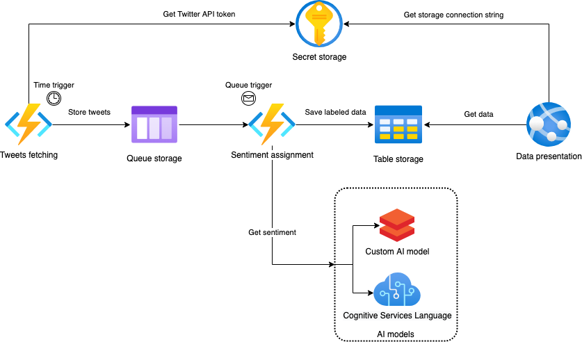

# Azure-Twitter-Sentiment-Analysis

Spis treści dokumentu

- [Azure-Twitter-Sentiment-Analysis](#azure-twitter-sentiment-analysis)
  - [Cel projektu](#cel-projektu)
  - [Skład zespołu](#skład-zespołu)
  - [Realizacja projektu](#realizacja-projektu)
  - [Funkcjonalność](#funkcjonalność)
  - [Stos technologiczny](#stos-technologiczny)
  - [Podział ról](#podział-ról)
  - [Harmonogram](#harmonogram)

## Cel projektu

Wykrywanie sentymentu wobec hashtagów w tweetach w języku polskim. Przypisywanie pozytywnego/neutralnego/negatywnego sentymentu do wypowiedzi dotyczących hashtagów w treści tweeta.

## Skład zespołu

- Szymon Męcina 299270 (Lider)
- Asia Smolska
- Damian Smugorzewski 299263
- Krzysiek Dąbrowski 293101
- Radek Cieślik 299237
- Szymon Wydziałkiewicz 299282

## Realizacja projektu

Projekt zostanie oparty o usługi i aplikacje udostępnione poprzez platformę Azure. Poniższy diagram przedstawia sposób użycia usług wybranych do projektu.

Projekt za pomocą triggera ustawionego w **Functions** uruchamia pobranie danych przez API Twittera, które przechowywane będą w **Table Storage**. Do przechowywania danych wrażliwych, takich jak token do API, zostanie użyty **Key Vault**. Pobrane dane będą poddane filtracji pozwalającej na konwersję tweetów o charakterze spamu na jeden element reprezentatywny oraz wybranie jedynie tych danych, które mogą uznać za wartościowe w kolejnych etapach analizy.

Aplikacja będzie udostępniona dla użytkowników za pomocą **Azure Web App**, gdzie zostanie przedstawiona analiza hashtagów, zaś użytkownik za pomocą interaktywnych filtrów będzie mieć możliwość wyboru analizy konkretnych hashtagów.

Przetwarzanie danych będzie realizowane w modelu z podwójnym przepływem, gdzie w jednej ścieżce analiza zostanie wykonana za pomocą **Cognitive Services**, zaś w drugim modelu zostanie użyty **Azure DataBricks** lub **Machine Learning**, gdzie będziemy mogli popisać się własną implementacją. Wyniku obu ścieżek będą porównywane (dokładność, skuteczność, możliwości).

Do zarządzania przepływem realizowanej pracy i zadań, zostanie wykorzystany **Azure DevOps**.

## Funkcjonalność

Planowaną funkcjonalność aplikacji widzianą od strony użytkownika prezentuje poniższy diagram przypadków użycia.

## Stos technologiczny

Wszystkie usługi chmurowe będą zrealizowane z użyciem platformy Azure. W usłudze Azure Web App po stronie frontendu zostanie użyty React.js wraz z Materials UI, zaś od strony backendu wykorzystany będzie Python 3 w oparciu o framework Flask.

## Podział ról

| Zadania                                | Szymon Wydziałkiewicz | Szymon Męcina | Krzysztof Dąbrowski | Radosław Cieślik | Joanna Smolska | Damian Smugorzewski |
| -------------------------------------- | :-------------------: | :-----------: | :-----------------: | :--------------: | :------------: | :-----------------: |
| Budowa aplikacji Back-End              |           X           |               |          X          |        X         |                |                     |
| Budowa aplikacji Front-End             |                       |       X       |          X          |                  |       X        |          X          |
| Product Owner                          |                       |       X       |                     |                  |                |                     |
| Scrum Master                           |                       |       X       |                     |                  |                |                     |
| AI specialist                          |                       |       X       |                     |                  |       X        |                     |
| Koordynator pobierania danych          |                       |               |          X          |                  |                |                     |
| Security specialist                    |                       |               |                     |        X         |                |                     |
| UI expert                              |                       |               |                     |                  |       X        |                     |
| Data specialist                        |           X           |       X       |          X          |                  |                |                     |
| Infrastructure Architect               |                       |               |          X          |                  |                |                     |
| Quality assurance                      |           X           |               |                     |                  |                |          X          |
| DevOps expert                          |                       |               |                     |        X         |                |                     |
| Koordynator prezentacji multimedialnej |                       |       X       |                     |                  |                |                     |

## Harmonogram

| Indeks |                                  Kamień milowy                                  |   Termin   |
| ------ | :-----------------------------------------------------------------------------: | :--------: |
| KM1    |       Przygotowanie architektury usług oraz pobieranie danych z Twittera        | 10.12.2020 |
| KM2    | Przypisywanie sentymentu z Cognitive Services oraz projekt interfejsu aplikacji | 07.01.2020 |
| MK3    |                          Podstawowa prezentacja danych                          | 14.01.2020 |
| KM4    |              Przypisywanie sentymentu z wykorzystaniem DataBricks               | 21.01.2020 |
| KM5    |                      Prezentacja finalnej wersji projektu                       | 28.01.2020 |
