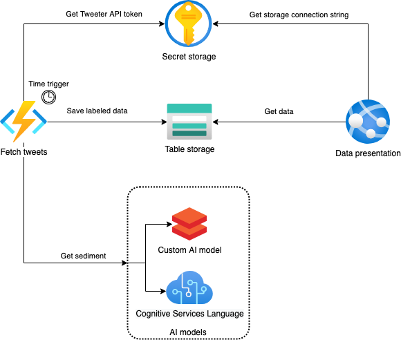
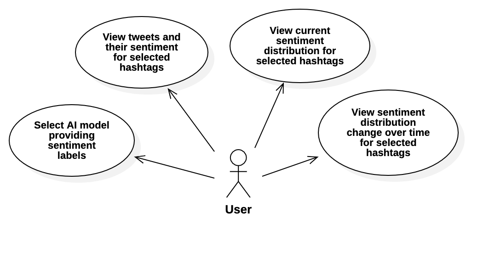

# Azure-Twitter-Sentiment-Analysis

Spis treści dokumentu

- [Azure-Twitter-Sentiment-Analysis](#azure-twitter-sentiment-analysis)
  - [Cel projektu](#cel-projektu)
  - [Realizacja projektu](#realizacja-projektu)
  - [Funkcjonalność](#funkcjonalność)
  - [Stos technologiczny](#stos-technologiczny)

## Cel projektu

Wykrywanie sentymentu wobec hashtagów w tweetach w języku polskim. Przypisywanie pozytywnego/neutralnego/negatywnego sentymentu do wypowiedzi dotyczących hashtagów w treści tweeta.

## Realizacja projektu

Projekt zostanie oparty o usługi i aplikacje udostępnione poprzez platformę Azure. Poniższy diagram przedstawia sposób użycia usług wybranych do projektu.

Projekt za pomocą triggera ustawionego w **Functions** uruchamia pobranie danych przez API Twittera, które przechowywane będą w **Table Storage**. Do przechowywania danych wrażliwych, takich jak token do API, zostanie użyty **Key Vault**. Pobrane dane będą poddane filtracji pozwalającej na konwersję tweetów o charakterze spamu na jeden element reprezentatywny oraz wybranie jedynie tych danych, które mogą uznać za wartościowe w kolejnych etapach analizy.

Aplikacja będzie udostępniona dla użytkowników za pomocą **Azure Web App**, gdzie zostanie przedstawiona analiza hashtagów, zaś użytkownik za pomocą interaktywnych filtrów będzie mieć możliwość wyboru analizy konkretnych hashtagów.

Przetwarzanie danych będzie realizowane w modelu z podwójnym przepływem, gdzie w jednej ścieżce analiza zostanie wykonana za pomocą **Cognitive Services**, zaś w drugim modelu zostanie użyty **Azure DataBricks** lub **Machine Learning**, gdzie będziemy mogli popisać się własną implementacją. Wyniku obu ścieżek będą porównywane (dokładność, skuteczność, możliwości).

Do zarządzania przepływem realizowanej pracy i zadań, zostanie wykorzystany **Azure DevOps**.

## Funkcjonalność

Planowaną funkcjonalność aplikacji widzianą od strony użytkownika prezentuje poniższy diagram przypadków użycia.

## Stos technologiczny

Wszystkie usługi chmurowe będą zrealizowane z użyciem platformy Azure. W usłudze Azure Web App po stronie frontendu zostanie użyty React.js wraz z Materials UI, zaś od strony backendu wykorzystany będzie Python 3 w oparciu o framework Flask.
